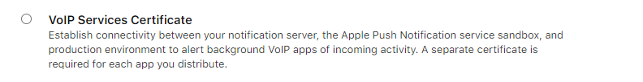

# twilio_voice

Provides an interface to Twilio's Programmable Voice SDK to allow voice-over-IP (VoIP) calling into your Flutter applications.
This plugin was taken from the original flutter_twilio_voice, as it seems that plugin is no longer maitained, this one is.

## Features
- Receive and place calls from iOS devices, uses callkit to receive calls.
- Receive and place calls from Android devices, uses custom UI to receive calls.

## Feature addition schedule:
- Web support
- Audio device selection support (select input/output audio devices)
- Add Bluetooth support (integration)
- Update plugin to Flutter federated packages
- Desktop platform support (implementation as JS wrapper/native implementation, t.b.d.)

Got a feature you want to add, suggest? File a feature request or PR.

### Android Limitations

As iOS has CallKit, an Apple provided UI for answering calls, there is no default UI for android to receive calls, for this reason a default UI was made. To increase customization, the UI will use a splash_icon.png registered on your res/drawable folder. I havent found a way to customize colors, if you find one, please submit a pull request.

### Setup
Please follow Twilio's quickstart setup for each platform, you dont need to write the native code but it will help you undestand the basic functionality of setting up your server, registering your iOS app for VOIP, etc.

### iOS Setup

To customize the icon displayed on a CallKit call, Open XCode and add a png icon named 'callkit_icon' to your assets.xassets folder

### Android Setup:
register in your `AndroidManifest.xml` the service in charge of displaying incomming call notifications:

``` xml
<Application>
  .....
  <service
      android:name="com.twilio.twilio_voice.fcm.VoiceFirebaseMessagingService"
      android:stopWithTask="false">
      <intent-filter>
          <action android:name="com.google.firebase.MESSAGING_EVENT" />
      </intent-filter>
  </service>
```


### Usage

The plugin was separated into two classes, the `TwilioVoice.instance` and `TwilioVoice.instance.call`, the first one is in charge of general configuration and the second one is in charge of managing calls.

Register iOS capabilities 
- Add Audio and Voice over IP in background modes

### TwilioVoice.instance


#### Setting the tokens

call `TwilioVoice.instance.setTokens` as soon as your app starts.
- `accessToken` provided from your server, you can see an example cloud function [here](https://github.com/diegogarciar/twilio_voice/blob/master/functions.js).
- `deviceToken` is automatically handled on iOS, for android you need to pass a FCM token.

call `TwilioVoice.instance.unregister` to unregister from Twilio, if no access token is passed, it will use the token provided in `setTokens` at the same session.


### Call Identifier
As incomming call UI is shown in background and the App can even be closed when receiving the calls, you can map call identifiers such as `firebaseAuth` userIds to real names, this operation must be done before actially receiving the call. So if you have a chat app, and know the members names, register them so when they call, the call UI can display their names and not their userIds.


#### Registering a client
```
TwilioVoice.instance.registerClient(String clientId, String clientName)
```

#### Unegistering a client
```
TwilioVoice.instance.unregisterClient(String clientId)
```

#### Default caller
You can also set a dafault caller, such as "unknown number" or "chat friend" in case a call comes in from an unregistered client.

```
TwilioVoice.instance.setDefaultCallerName(String callerName)
```

### Call Events
use stream `TwilioVoice.instance.callEventsListener` to receive events from the TwilioSDK such as call events and logs, it is a broadcast so you can listen to it on different parts of your app. Some events might be missed when the app has not launched, please check out the example project to find the workarounds.

The events sent are the following
- ringing
- connected
- callEnded
- unhold
- hold
- unmute
- mute
- speakerOn
- speakerOff
- log
- answer

## showMissedCallNotifications
By default a local notification will be shown to the user after missing a call, clicking on the notification will call back the user. To remove this feature, set `showMissedCallNotifications` to `false`.


### Calls


#### Make a Call
`from` your own identifier
`to` the id you want to call
use `extraOptions` to pass additional variables to your server callback function.
```
 await TwilioVoice.instance.call.place(from:myId, to: clientId, extraOptions)
                   ;

```

#### Mute a Call

```
 TwilioVoice.instance.call.toggleMute(isMuted: true);

```

#### Toggle Speaker

```
 TwilioVoice.instance.call.toggleSpeaker(speakerIsOn: true);

```

#### Hang Up

```
 TwilioVoice.instance.call.hangUp();

```

#### Send Digits

```
 TwilioVoice.instance.call.sendDigits(String digits);

```


### Permissions

#### Microphone
To receive and place calls you need Microphone permisisons, register the micropohone permission in your info.plist for iOS.

You can use `TwilioVoice.instance.hasMicAccess` and `TwilioVoice.instance.requestMicAccess` to check and request the permission. Permissions is also automatically requested when receiving a call.

#### Background calls (Android only on some devices)
Xiami devices, and maybe others, need a spetial permission to receive background calls. use `TwilioVoice.instance.requiresBackgroundPermissions` to check if your device requires a special permission, if it does, show a rationale explaining the user why you need the permisison. Finally call 
`TwilioVoice.instance.requestBackgroundPermissions` which will take the user to the App Settings page to enable the permission.


### Localization
Because some of the UI is in native code, you need to localize those strings natively in your project. You can find in the example project localization for spanish, PRs are welcome for other languages.

---


## Twilio Setup/Quickstart Help

Twilio makes use of cloud functions to generate access tokens and sends them to your app. Further, Twilio makes use of their own apps called TwiML apps to handle calling functions, etc

There are 2 major components to get Twilio Setup.

1. Cloud functions (facility generating **access tokens** and then **handling call requests**)
2. Mobile app that receives/updates tokens and performs the actual calls (see above)

---

### 1) Cloud Funtions

Cloud functions can be seperated or grouped together. The main 2 components are:
- generate access tokens
- `make-call` endpoint to actually place the call

You can host both in firebase, in TwiML apps or a mixture. The setup below assumes a mixture, where Firebase Functions hosts the `access-token` for eashy integration into Flutter and TwiML hosting the `make-call` function.

## Cloud-Functions-Step-1: Create your TwiML app

This will allow you to actually place the call

Prerequisites
---

* A Twilio Account. Don't have one? [Sign up](https://www.twilio.com/try-twilio) for free!

## Setting up the Application

Grab [this](https://github.com/twilio/voice-quickstart-server-node) project from github, the sample TwiML app.

```bash
cp .env.example .env
```

Edit `.env` with the three configuration parameters we gathered from above.

**See configure environment below for details**

Next, we need to install our dependencies from npm:

```bash
npm install
```

To make things easier for you, go into the `src/` folder, rename the `server.js` file to `make-call`. This assumes each function will have its own file which for a new project isn't a bad idea.

Then add the following code:

```javascript
const AccessToken = require('twilio').jwt.AccessToken;
const VoiceGrant = AccessToken.VoiceGrant;
const VoiceResponse = require('twilio').twiml.VoiceResponse;

/**
 * Creates an endpoint that can be used in your TwiML App as the Voice Request Url.
 * <br><br>
 * In order to make an outgoing call using Twilio Voice SDK, you need to provide a
 * TwiML App SID in the Access Token. You can run your server, make it publicly
 * accessible and use `/makeCall` endpoint as the Voice Request Url in your TwiML App.
 * <br><br>
 *
 * @returns {Object} - The Response Object with TwiMl, used to respond to an outgoing call
 * @param context
 * @param event
 * @param callback
 */
exports.handler = function(context, event, callback) {
    // The recipient of the call, a phone number or a client

    console.log(event);
    const from = event.From;
    let to = event.to;
    if(isEmptyOrNull(to)) {
        to = event.To;
        if(isEmptyOrNull(to)) {
            console.error("Could not find someone to call");
            to = undefined;
        }
    }


    const voiceResponse = new VoiceResponse();

    if (!to) {
        voiceResponse.say("Welcome, you made your first call.");
    } else if (isNumber(to)) {
      const dial = voiceResponse.dial({callerId : callerNumber});
      dial.number(to);
  } else {
        console.log(`Calling [${from}] -> [${to}]`)

        const dial = voiceResponse.dial({callerId: to, timeout: 30, record: "record-from-answer-dual", trim: "trim-silence"});
        dial.client(to);
    }

    callback(null, voiceResponse);
}

const isEmptyOrNull = (s) => {
    return !s || s === '';
}
```

### Setup Twilio CLI

Ensure you are logged into `twilio-cli`. First, install `twilio-cli` with

```javascript
npm i twilio-cli -g
```

Afterwards, login to twilio using: (b sure to provide Twilio account SID and auth token for login):

```javascript
twilio login
```

We need to generate an app, this will give us an App SID to use later in firebase functions, (see [this](https://github.com/twilio/voice-quickstart-ios#3-create-a-twiml-application-for-the-access-token) more info)

### Create TwiML app

We need to create a TwiML app that will allow us to host a `make-call` function:

```bash
twilio api:core:applications:create \
--friendly-name=my-twiml-app \
--voice-method=POST \
--voice-url="https://my-quickstart-dev.twil.io/make-call"
```

This will present you with a application SID in the format ```APxxxxxxxxxxxxxxxxxxxxxxxxxxxxxxxx```, we will use this later in firebase config and generating push credential keys.

**Very Important!** The URL given here `https://my-quickstart-dev.twil.io/make-call` won't work for you. Once you deployed your TwiML application (later), a URL is given to you (on first deploy) which you need to copy and paste as your **Request URL** call. If you don't do this, calling won't work!

### Configure environment

ensure you have a `.env` file in the root of your project in the same directory as `package.json`

next, edit the `.env` file in the format

```bash
ACCOUNT_SID=(insert account SID)
APP_SID=(insert App SID, found on TwiML app or the APxxxxx key above)
```
`API_KEY` and `API_KEY_SECRET` aren't necessary here since we won't be using them

#### Get Push Credential:

**We will generate them a bit later**

- Android FCM: [Android instructions](https://github.com/twilio/voice-quickstart-android#7-create-a-push-credential-using-your-fcm-server-key)
- Apple APNS: [Apple instructions](https://github.com/twilio/voice-quickstart-ios#6-create-a-push-credential-with-your-voip-service-certificate)

You will get a Push Credential SID in the format: `CRxxxxxxxxxxxxxxxxxxxxxxxxxxxxxxxx`, use this in `PUSH_CREDENTIAL_SID`

### Deploying

Now lets deploy.

#### Please note:  Check you have configured your environment first

Navigate to root directory, and deploy using

```javascript
twilio serverless:deploy
```

**Very Important!**: once complete (if you haven't done so), make sure to add the `make-call` endpoint your Twilio app's `Request URL` in the main Twilio page. This URL will be shown as part of the deployment text. If this isn't done, calling won't work!


### Cloud-Functions-Step-2: Setup Firebase & Configuration

Twilio's configurations are stored in `.runtimeconfig.json` which contains:

    "auth_token": "",
    "account_sid": "",
    "app_sid": "",
    "phone": "",
    "api_key": "",
    "api_key_secret": "",
    "android_push_credential": "",
    "apple_push_credential_debug": "",
    "apple_push_credential_release": ""

_**Note:** this is used for local emulator testing, but you need to deploy these to your firebase function application once you are ready to go live. If you don't, this won't work!_

**Push Credentials** are created once (for iOS, Android) and used to generate `access-token`s, a callback function for all Twilio apps to use for their communication.

---

Below are the 3 operations you need to run to generate push credentials that should be added into the `.runtimeconfig.json` above

##### Android
To generate Android push credentials, get the Cloud Messaging server key from Firebase FCM, and add it to the following:

```
twilio api:chat:v2:credentials:create \
--type=fcm \
--friendly-name="voice-push-credential-fcm" \
--secret=SERVER_KEY_VALUE
```

and then place into the field: `android_push_credential` above

This generated a push credential SID in the format `CRxxxxxxxxxxxxxxxxxxxxxxxxxxxxxxxx` which must be used to generate access tokens for android devices.

see for more info: https://github.com/twilio/voice-quickstart-android#7-create-a-push-credential-using-your-fcm-server-key

##### iOS

Similar to Android, but more steps including using .p12 certificates. To get these certificates, login into [Apple's developer site](https://developer.apple.com/) and go to the [certificates page](https://developer.apple.com/account/resources/certificates/list). You need to generate a VoIP Services certificate as shown below.



**Please note:** there are 2 different modes: sandbox and production.

**- SandBox Mode**

Using sandbox VoIP certificate:

> Export your VoIP Service Certificate as a .p12 file from Keychain Access and extract the certificate and private key from the .p12 file using the openssl command.

```
$ openssl pkcs12 -in PATH_TO_YOUR_SANDBOX_P12 -nokeys -out sandbox_cert.pem -nodes
$ openssl pkcs12 -in PATH_TO_YOUR_SANDBOX_P12 -nocerts -out sandbox_key.pem -nodes
$ openssl rsa -in sandbox_key.pem -out sandbox_key.pem
```

Using sandbox certificates, generate credential:

```
twilio api:chat:v2:credentials:create \
--type=apn \
--sandbox \
--friendly-name="voice-push-credential (sandbox)" \
--certificate="$(cat PATH_TO_SANDBOX_CERT_PEM)" \
--private-key="$(cat PATH_TO_SANDBOX_KEY_PEM)"
```

then place it into the field `apple_push_credential_debug`

**- Production Mode**

Using production VoIP certificate:

> Export your VoIP Service Certificate as a .p12 file from Keychain Access and extract the certificate and private key from the .p12 file using the openssl command.

```
$ openssl pkcs12 -in PATH_TO_YOUR_P12 -nokeys -out prod_cert.pem -nodes
$ openssl pkcs12 -in PATH_TO_YOUR_P12 -nocerts -out prod_key.pem -nodes
$ openssl rsa -in prod_key.pem -out prod_key.pem
```

Using production certificates, generate credential:

```
twilio api:chat:v2:credentials:create \
--type=apn \
--friendly-name="voice-push-credential (production)" \
--certificate="$(cat PATH_TO_PROD_CERT_PEM)" \
--private-key="$(cat PATH_TO_PROD_KEY_PEM)"
```

then place it into the field `apple_push_credential_release`

see for more info: https://github.com/twilio/voice-quickstart-ios#6-create-a-push-credential-with-your-voip-service-certificate

---

## Cloud-Functions-Step-3: Generate access tokens via cloud function

`HTTP/GET api-voice-accessToken`

To generate **access-tokens**, the following firebase function is used:

_**Please Note** the default time is 1 hour token validity._ 

See for more info: https://github.com/twilio/voice-quickstart-android/blob/master/Docs/access-token.md

**Firebase Cloud Function: access-token**

```javascript
const { AccessToken } = require('twilio').jwt;
const functions = require('firebase-functions');

const { VoiceGrant } = AccessToken;

/**
 * Creates an access token with VoiceGrant using your Twilio credentials.
 *
 * @param {Object} request - POST or GET request that provides the recipient of the call, a phone number or a client
 * @param {Object} response - The Response Object for the http request
 * @returns {string} - The Access Token string and expiry date in milliseconds
 */
exports.accessToken = functions.https.onCall((payload, context) => {
    // Check user authenticated
    if (typeof (context.auth) === 'undefined') {
        throw new functions.https.HttpsError('unauthenticated', 'The function must be called while authenticated');
    }
    let userId = context.auth.uid;

    console.log('creating access token for ', userId);

    //configuration using firebase environment variables
    const twilioConfig = functions.config().twilio;
    const accountSid = twilioConfig.account_sid;
    const apiKey = twilioConfig.api_key;
    const apiSecret = twilioConfig.api_key_secret;
    const outgoingApplicationSid = twilioConfig.app_sid;

    // Used specifically for creating Voice tokens, we need to use seperate push credentials for each platform. 
    // iOS has different APNs environments, so we need to distinguish between sandbox & production as the one won't work in the other.
    let pushCredSid;
    if (payload.isIOS === true) {
        console.log('creating access token for iOS');
        pushCredSid = payload.production ? twilioConfig.apple_push_credential_release
            : (twilioConfig.apple_push_credential_debug || twilioConfig.apple_push_credential_release);
    } else if (payload.isAndroid === true) {
        console.log('creating access token for Android');
        pushCredSid = twilioConfig.android_push_credential;
    } else {
        throw new functions.https.HttpsError('unknown_platform', 'No platform specified');
    }

    // generate token valid for 24 hours - minimum is 3min, max is 24 hours, default is 1 hour
    const dateTime = new Date();
    dateTime.setDate(dateTime.getDate()+1);
    // Create an access token which we will sign and return to the client,
    // containing the grant we just created
    const voiceGrant = new VoiceGrant({
        outgoingApplicationSid,
        pushCredentialSid: pushCredSid,
    });
w
    // Create an access token which we will sign and return to the client,
    // containing the grant we just created
    const token = new AccessToken(accountSid, apiKey, apiSecret);
    token.addGrant(voiceGrant);

    // use firebase ID for identity
    token.identity = userId;
    console.log(`Token:${token.toJwt()}`);

    // return json object
    return {
        "jwt_token": token.toJwt(),
        "expiry_date": dateTime.getTime()
    };
});
```

Add the function above to your Firebase Functions application, see [this](https://firebase.google.com/docs/functions/get-started) for more help on creating a firebase functions project

After you are done, deploy your `.runtimeconfig.json`, see [this](https://firebase.google.com/docs/functions/config-env) for more help.

Once done with everything above, deploy your firebase function with this: 
```bash
firebase deploy --only functions
```

##### Done! 

Calling should work naturally - just make sure to fetch the token from the endpoint and you can call

See [example](https://github.com/diegogarciar/twilio_voice/blob/master/example/lib/main.dart#L51) code, make sure to change the `voice-accessToken` to your function name, given to you by firebase when deploying (as part of the deploy text)
