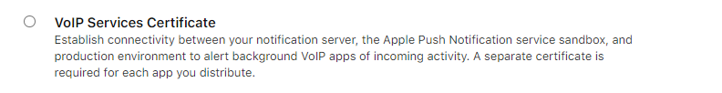

# twilio_voice

Provides an interface to Twilio's Programmable Voice SDK to allow voice-over-IP (VoIP) calling into your Flutter applications.
~~This plugin was taken from the original `flutter_twilio_voice` as it seems that plugin is no longer maintained, this one is.~~  Project ownership & maintenance handed over by [diegogarcia](https://github.com/diegogarciar). For the foreseeable future, I'll be actively maintaining this project.

#### 🐞Bug? Issue? Something odd?

Report it [here](https://github.com/cybex-dev/twilio_voice/issues/new?assignees=&labels=type:Bug,status:Unconfirmed&projects=&template=BUG_REPORT.md&title=).

#### 🚀 Feature Requests?

Any and all [Feature Requests](https://github.com/cybex-dev/twilio_voice/issues/new?assignees=&labels=type:Enhancement&projects=&template=FEATURE_REQUEST.md&title=) or Pull Requests are gladly welcome!

#### Live Example/Samples:

- [Twilio Voice Web](https://twilio-voice-web.web.app/#/)

*Currently, only Web sample is provided. If demand arises for a Desktop or Mobile builds, I'll throw one up on the relevant store/app provider or make one available.*

## Features

- Receive and place calls from iOS devices, uses Callkit to receive calls (Twilio Voice SDK [v6.13.6](https://www.twilio.com/docs/voice/sdks/ios/changelog#6136)).
- Receive and place calls from Android devices, uses ~~custom UI~~ native call screen to receive calls (via a `ConnectionService` impl) (Twilio Voice SDK [v6.10.0](https://www.twilio.com/docs/voice/sdks/android/3x-changelog#6100)).
- Receive and place calls from Web [v2.18.0](https://www.twilio.com/docs/voice/sdks/javascript/changelog#2180-january-5-2026) (FCM push notification integration not yet supported by Twilio Voice Web, see [here](https://github.com/twilio/twilio-voice.js/pull/159#issuecomment-1551553299) for discussion)
- Receive and place calls from MacOS devices, uses custom UI to receive calls (in future & macOS
  13.0+, we'll be using CallKit) based on [v2.18.0](https://www.twilio.com/docs/voice/sdks/javascript/changelog#2180-january-5-2026)
- Get live [call quality metrics](https://www.twilio.com/docs/voice/voice-insights/api/call/call-metrics-resource).
- Interpret TwiML parameters to populate UI, see below [Interpreting Parameters](#interpreting-parameters)

### Feature addition schedule:

- Audio device selection support (select input/output audio devices, on-hold)
- Update plugin to Flutter federated packages (step 1 of 2 with Web support merge)
- Desktop platform support (implementation as JS wrapper/native implementation, Windows/Linux to start development)

### Android Limitations

~~As iOS has CallKit, an Apple provided UI for answering calls, there is no default UI for android to
receive calls, for this reason a default UI was made. To increase customization, the UI will use a
splash_icon.png registered on your res/drawable folder. I haven't found a way to customize colors,
if you find one, please submit a pull request.~~

Android provides a native UI by way of the `ConnectionService`. Twilio has made an attempt a [ConnectionService](https://github.com/twilio/voice-quickstart-android/tree/master/app/src/connection_service) implementation however it is fully realized in this package.

Native UI callback feature does not yet work as may not be functional for a while, see [Android Callback](NOTES.md#callback).

### macOS Limitations

This limits macOS to not support remote push notifications `.voip` and `.apns` as the web SDK does
not support this. Instead, it uses a web socket connection to listen for incoming calls, arguably
more efficient vs time but forces the app to be open at all times to receive incoming calls.

## Getting Started

First, add the package to your `pubspec.yaml` file:

```yaml
dependencies:
  ...
  twilio_voice: ^0.5.0
```

Then run `flutter pub get` in your terminal.

Please follow Twilio's quickstart setup for each platform, you don't need to write the native code
but it will help you understand the basic functionality of setting up your server, registering your
iOS app for VOIP, etc.

### Swift Package Manager (iOS & macOS)

This plugin ships both a Swift package and a podspec, so it works with either integration. If your
app uses CocoaPods there is nothing to do - it keeps working exactly as before.

To use Swift Package Manager instead, enable it once for your Flutter install:

```bash
flutter config --enable-swift-package-manager
```

Flutter then resolves this plugin through SPM, and the iOS Twilio Voice SDK is pulled from
[twilio/twilio-voice-ios](https://github.com/twilio/twilio-voice-ios) (6.13.6+) instead of the
`TwilioVoice` pod. `TwilioVoice.framework` is embedded into your app automatically; no manual
"Frameworks, Libraries and Embedded Content" step is needed.

Two things to be aware of:

- **macOS apps must set their deployment target to 11.0 or later.** CocoaPods tolerates an app
  target below a pod's minimum, but SwiftPM does not, and the build fails with:

  > error: The package product 'twilio-voice' requires minimum platform version 11.0 for the macOS
  > platform, but this target supports 10.15

  Set `macOS Deployment Target` to `11.0` on the Runner target in Xcode (Flutter's own template
  still defaults to 10.15). iOS already requires 13.0, which matches Flutter's template default.

- Enabling SPM is a per-machine Flutter setting, not a per-project one. Plugins that do not yet
  support SPM continue to be resolved through CocoaPods alongside it, so mixed projects are fine.

### iOS Setup

To customize the icon displayed on a CallKit call, Open XCode and add a png icon named '
callkit_icon' to your assets.xassets folder

see [[Notes]](https://github.com/cybex-dev/twilio_voice/blob/master/NOTES.md#ios--macos) for more information

**FAQ:**
- Why am I seeing `notification_missed_call` or `mic_permission_title` and not the actual text?
  - Copy over the file from the example app: `example/ios/Runner/en.lproj/Localizable.strings` and modify the strings as you wish.

### macOS Setup

Drop in addition.

see [[Limitations]](https://github.com/cybex-dev/twilio_voice/blob/master/NOTES.md#macos) and [[Notes]](https://github.com/cybex-dev/twilio_voice/blob/master/NOTES.md#ios--macos) for more information.

### Android Setup:

Since Twilio Voice uses FCM to deliver incoming call notifications, you need to ensure that your app is set up to receive FCM messages. Some plugins subclass `FirebaseMessagingService` to handle FCM messages, which does not play well with `twilio_voice`, see [Android FCM setup](NOTES.md#android-fcm-setup) for more information.

Are you subclassing `FirebaseMessagingService` or using another package that does? e.g. `awesome_notifications_fcm`? (`firebase_messaging` does not apply here). _If you are not sure, read the help here: [am I subclassing FirebaseMessagingService](NOTES.md#android-subclassing-fcm))_
- If **no**, continue below (or [Standard Android FCM setup](#standard-android-fcm-setup)).
- If **yes**, proceed to [Using FCM alongside another package](#using-fcm-alongside-another-package).

#### standard Android FCM setup
register in your `AndroidManifest.xml` the service in charge of displaying incoming call notifications:

> [!IMPORTANT]
> Only do this if your app does **not** otherwise use FCM. If another package already registers a
> `FirebaseMessagingService` (`awesome_notifications_fcm`, ...), see
> [Using FCM alongside another package](#using-fcm-alongside-another-package) instead.

```xml

<Application>
    ...
    <service android:name="com.twilio.twilio_voice.fcm.VoiceFirebaseMessagingService"
        android:stopWithTask="false">
        <intent-filter>
            <action android:name="com.google.firebase.MESSAGING_EVENT" />
        </intent-filter>
    </service>
    ...
</Application>
```

#### Using FCM alongside another package

> [!IMPORTANT]
> Do this ONLY IF you are using another package that already registers a `FirebaseMessagingService` (e.g. `awesome_notifications_fcm`, ...). If your app does **not** otherwise use FCM, see [standard Android FCM setup](#standard-android-fcm-setup) instead.


In your `FirebaseMessagingService` subclass, forward all messages to the Twilio Voice plugin. If the message is a Twilio Voice call invite, the plugin will handle it and you don't need to do anything else.
```kotlin
package com.example.myapp

import com.google.firebase.messaging.FirebaseMessagingService
import com.google.firebase.messaging.RemoteMessage
import com.twilio.twilio_voice.fcm.TwilioVoiceFcm

class MyMessagingService : FirebaseMessagingService() {

    override fun onMessageReceived(remoteMessage: RemoteMessage) {
        // Twilio Voice call invite - handled, nothing further to do.
        if (TwilioVoiceFcm.handleMessage(this, remoteMessage.data)) return

        // ...not a Twilio Voice payload, handle it yourself.
    }

    override fun onNewToken(token: String) {
        // Keep Twilio's registration bound to the current device token.
        TwilioVoiceFcm.updateToken(this, token)

        // ...forward the rotated token to your own services too.
    }
}
```

Ensure your `AndroidManifest.xml` registers your service and make sure you remove the Twilio Voice service registration if you previously added it:

```xml
<service android:name="com.example.myapp.MyMessagingService"
    android:stopWithTask="false">
    <intent-filter>
        <action android:name="com.google.firebase.MESSAGING_EVENT" />
    </intent-filter>
</service>
```

**Keeping the device token in sync.** `onNewToken` is delivered to the same single service as
messages, so a service replacing `VoiceFirebaseMessagingService` must forward rotations via
`TwilioVoiceFcm.updateToken(...)` as shown above. Without it Twilio keeps the stale binding, pushes
go to a dead token and incoming calls silently stop.

`updateToken` is best-effort: re-registration needs a cached Twilio access token, so it only takes
effect while the plugin is running. Mirroring it in Dart covers the rest, and is worth doing
regardless of your FCM setup:

```dart
FirebaseMessaging.instance.onTokenRefresh.listen((token) async {
  await TwilioVoicePlatform.instance.setTokens(
    accessToken: currentAccessToken,
    deviceToken: token,
  );
});
```


#### Phone Account

To register a Phone Account, request access to `READ_PHONE_NUMBERS` permission first:

```dart
TwilioVoicePlatform.instance.requestReadPhoneNumbersPermission();  // Gives Android permissions to read Phone Accounts
```

then, register the `PhoneAccount` with:

```dart
TwilioVoicePlatform.instance.registerPhoneAccount();
```

#### Enable calling account

To open the `Call Account` settings, use the following code:

```dart
TwilioVoicePlatform.instance.openPhoneAccountSettings();
```

Check if it's enabled with:

```dart
TwilioVoicePlatform.instance.isPhoneAccountEnabled();
```

#### Calling with ConnectionService

Placing a call with Telecom app via Connection Service requires a `PhoneAccount` to be registered. See [Phone Account](#phone-account) above for more information.

Finally, to grant access to place calls, run:

```dart
TwilioVoicePlatform.instance.requestCallPhonePermission();  // Gives Android permissions to place calls
```

See [Customizing the Calling Account](#customizing-the-calling-account) for more information.

#### Enabling the ConnectionService

To enable the `ConnectionService` and make/receive calls, run:

```dart
TwilioVoicePlatform.instance.requestReadPhoneStatePermission();  // Gives Android permissions to read Phone State
```

Highly recommended to review the notes for **Android**. See [[Notes]](https://github.com/cybex-dev/twilio_voice/blob/master/NOTES.md#android) for more information.

#### Customizing the Calling Account

To customize the `label` and `shortDescription` of the calling account, add the following in your `res/values/strings.xml`:

```xml
<string name="phone_account_name" translatable="false">Example App</string>
<string name="phone_account_desc" translatable="false">Example app voice calls calling account</string>
```

This can be found in alternatively the Phone App's settings, `Other/Advanced Call Settings -> Calling Accounts -> (Example App)` (then toggle the switch)


See [example](https://github.com/cybex-dev/twilio_voice/blob/master/example/android/app/src/main/res/values/strings.xml) for more details

#### Known Issues

##### Bluetooth, Telecom App Crash

- Callback action on post dialer screen may not work as expected - this is platform and manufacturer specific. PRs are welcome here.

#### Android FAQ:
1. **Why are calls failing in release mode?**

   There are certainly a number of factors, but for starting point:
   1. first review [Android Setup](README.md#android-setup) closely. 
   2. Compare the example app's configuration files to your app. 
   3. Check Twilio's Error logs in the dashboard.

2. **Why am I not receiving any calls on Android?**

   1. First, review [Android Setup](README.md#android-setup) closely.
   2. Ensure you have setup & configured Twilio with the new FCM HTTP v1 API, see [here](https://help.twilio.com/articles/20768292997147-Updating-Twilio-Push-for-FCM-HTTP-v1-API). Thanks [@Erchil66's](https://github.com/cybex-dev/twilio_voice/issues/251#issuecomment-2515050331) suggestion.

### Web Setup:

Nothing to do, the plugin handles everything for you.

The Twilio Voice JS SDK is now **bundled with this plugin** and loaded automatically, and since
`web_callkit` 1.0.0 the notification service worker is bundled and registered automatically too.
There are **no files to copy** into your `web/` directory and **no `<script>` tag to add** to your
`web/index.html`.

**Migrating from a previous version?** Remove the Twilio Voice JS SDK `<script>` tag from your
`web/index.html` and delete `twilio.min.js` / `js_notifications-sw.js` from your `web/` folder if
you copied them there:

This is optional - if you leave your own `<script>` tag in place, the plugin detects the existing
`window.Twilio` global and will **not** inject a second copy, so existing integrations keep working.
Note that a self-supplied SDK is *not* version-checked against the plugin, so prefer removing it
and using the bundled version this plugin was built against.

The SDK is loaded automatically the first time you call
`TwilioVoicePlatform.instance.setTokens(...)`. If you would like to pre-load it earlier (e.g. on a
splash screen) you can await it explicitly:

```dart
// web only
await (TwilioVoicePlatform.instance as TwilioVoiceWeb).ensureSdkLoaded();
```

If the SDK fails to load, `setTokens(...)` returns `false` and the reason is emitted as a `LOG`
call event.

See [[Notes]](https://github.com/cybex-dev/twilio_voice/blob/master/NOTES.md#web) and
[THIRD_PARTY_LICENSES.md](THIRD_PARTY_LICENSES.md) for the bundled SDK version and its license.

**Note:** the service worker (provided by `web_callkit`/`js_notifications`) lets the browser handle
notifications in the background - displaying incoming call notifications even when the app is not in
focus. It is registered for you; no manual copy step is required.

**WASM:** the web implementation uses `dart:js_interop`/`package:web`, so it supports
`flutter build web --wasm`. This requires Dart `>=3.3.0` and Flutter `>=3.22.0`.

#### Web Considerations

_If you need to debug the service worker, open up Chrome Devtools, go to Application tab, and select Service Workers from the left menu. There you can see the service workers and their status.
To review service worker `notificationclick`, `notificationclose`, `message`, etc events - do this using Chrome Devtools (Sources tab, left panel below 'site code' the service workers are listed)_ 

##### Web Notifications

Notifications are presented as **alerts**. If you notifications aren't shown or visible, check:
 - if the browser supports notifications,
 - if the user has granted permissions to show notifications,
 - if the notifications display method / notifications is enabled by the system (e.g. macOS notifications are disabled, or Windows notifications are disabled, etc).
 - if there are already notifications shown (https://stackoverflow.com/a/36383155/4628115)
 - if system is in 'Do Not Disturb' or 'Focus' mode.

If you need manual control over some notifications, e.g. notifying twilio of a queued/missed call from FCM/service worker, you can do so by hooking into the [web_callkit](https://pub.dev/packages/web_callkit) directly. For example,

```dart
// import
import 'package:web_callkit/web_callkit.dart';

// Get call sid used as unique identifier
void _notifyMissedCall() async {
  final callSid = await TwilioVoicePlatform.instance.call.getSid();
  WebCallkit.instance.reportCallDisconnected(callSid!, response: CKDisconnectResponse.missed);
}
```

### MacOS Setup:

The plugin is essentially a [WKWebView](https://developer.apple.com/documentation/webkit/wkwebview)
wrapper. This makes macOS integration a drop-in solution.

However, you'll need to:

1. add the following to your `Info.plist` file:

   ```xml
   <key>NSMicrophoneUsageDescription</key>
   <string>Allow microphone access to make calls</string>
   ```
2. include Hardened Runtime entitlements (this is required for App Store distributed MacOS apps):

   ```xml
   <key>com.apple.security.device.audio-input</key>
   <true/>

   <!--Optionally for bluetooth support/permissions-->
   <key>com.apple.security.device.bluetooth</key>
   <true/>
   ```
3. Lastly and most importantly, ensure the `index.html` and `twilio.min.js` is bundled inside of `twilio_voice` package (this
   shouldn't be a problem, but just in case). Found in `twilio_voice.../.../Classes/Resources/*`.

See [this](https://developer.apple.com/documentation/security/notarizing_macos_software_before_distribution#3087727)
for more information on preparing for publishing your macOS app

### Usage

The plugin was separated into two classes, the `TwilioVoicePlatform.instance`
and `TwilioVoicePlatform.instance.call`, the first one is in charge of general configuration and the second
one is in charge of managing calls.

Register iOS capabilities

- Add Audio and Voice over IP in background modes

### TwilioVoicePlatform.instance

#### Setting the tokens

call `TwilioVoicePlatform.instance.setTokens` as soon as your app starts.

- `accessToken` provided from your server, you can see an example cloud
  function [here](https://github.com/cybex-dev/twilio_voice/blob/master/functions.js).
- `deviceToken` is automatically handled on iOS, for android you need to pass a FCM token.

call `TwilioVoicePlatform.instance.unregister` to unregister from Twilio, if no access token is passed, it
will use the token provided in `setTokens` at the same session.

### Call Identifier

As incoming call UI is shown in background and the App can even be closed when receiving the calls,
you can map call identifiers such as `firebaseAuth` userIds to real names, this operation must be
done before actually receiving the call. So if you have a chat app, and know the members names,
register them so when they call, the call UI can display their names and not their userIds.

#### Registering a client

```
TwilioVoicePlatform.instance.registerClient(String clientId, String clientName)
```

#### Unregistering a client

```
TwilioVoicePlatform.instance.unregisterClient(String clientId)
```

#### Default caller

You can also set a default caller, such as "unknown number" or "chat friend" in case a call comes in
from an unregistered client.

```
TwilioVoicePlatform.instance.setDefaultCallerName(String callerName)
```

### Call Events

use stream `TwilioVoicePlatform.instance.callEventsListener` to receive events from the TwilioSDK such as
call events and logs, it is a broadcast so you can listen to it on different parts of your app. Some
events might be missed when the app has not launched, please check out the example project to find
the workarounds.

The events sent are the following

- incoming // web, MacOS only
- ringing
- connected
- reconnected
- reconnecting
- callEnded
- unhold
- hold
- unmute
- mute
- speakerOn
- speakerOff
- log
- declined (based on Twilio Error codes, or remote abort)
- answer
- missedCall
- returningCall
- permission (Android only)

### Interpreting Parameters

As a convenience, the plugin will interpret the TwiML parameters and send them as a map in the `CallInvite` or provided via `extraOptions` when creating the call. This is useful for passing additional information to the call screen and are prefixed with `__TWI`.

- `__TWI_CALLER_ID` - caller id
- `__TWI_CALLER_NAME` - caller name
- `__TWI_CALLER_URL` - caller image/thumbnail url (not implemented/supported at the moment)
- `__TWI_RECIPIENT_ID` - recipient id
- `__TWI_RECIPIENT_NAME` - recipient name
- `__TWI_RECIPIENT_URL` - recipient image/thumbnail url (not implemented/supported at the moment)
- `__TWI_SUBJECT` - subject/additional info

These parameters above are interpreted as follows.

#### Name resolution

Caller is usually referred to as `call.from` or `callInvite.from`. This can either be a number of a string (with the format `client:clientName`) or null. 

_Note: All platforms provide the raw `from`/`to` values in call events stream i.e. (`TwilioVoicePlatform.instance.callEventsListener`) allowing the developer to interpret these as needed._

The following rules are applied to determine the caller/recipient name, which is shown in the call screen and heads-up notification:

##### Incoming Calls:

`__TWI_CALLER_NAME` -> `resolve(__TWI_CALLER_ID)` -> (phone number) -> `registered client (from)` -> `defaultCaller name` -> `"Unknown Caller"`


##### Outgoing Calls:

`__TWI_RECIPIENT_NAME` -> `resolve(__TWI_RECIPIENT_ID)` -> (phone number) -> `registered client (to)` -> `defaultCaller name` -> `"Unknown Caller"`

**Details explaination:**

- if the call is an CallInvite (incoming), the plugin will interpret the string as follows or if the call is outgoing, the twilio `To` parameter field is used to:
  - if the `__TWI_CALLER_NAME` (or `__TWI_RECIPIENT_NAME`) parameter is provided, the plugin will show the value of `__TWI_CALLER_NAME` (or `__TWI_RECIPIENT_NAME`) as is, else
  - if the `__TWI_CALLER_ID` (or `__TWI_RECIPIENT_ID`) parameter is provided, the plugin will search for a registered client with the same id and show the client name,
- if the caller (`from` or `to` fields) is empty/not provided, the default caller name is shown e.g. "Unknown Caller", else
- else if the caller (`from` or `to` fields) is a number, the plugin will show the number as is, else
- else the plugin will search for a registered client with the `callInvite.from` (or call.to) value and show the client name, as a last resort
  - the default caller name is shown e.g. "Unknown Caller"

*Please note: the same approach applies to both caller and recipient name resolution.*

#### Subject

Using the provided `__TWI_SUBJECT` parameter, the plugin will show the subject as is, else (depending on the platform and manufacturer), the plugin will show:

- the caller name as the subject, or
- the app name as the subject, or
- the default subject "Incoming Call"

## showMissedCallNotifications

By default a local notification will be shown to the user after missing a call, clicking on the
notification will call back the user. To remove this feature, set `showMissedCallNotifications`
to `false`.

### Calls

#### Make a Call

`from` your own identifier
`to` the id you want to call
use `extraOptions` to pass additional variables to your server callback function.

```
 await TwilioVoicePlatform.instance.call.place(from:myId, to: clientId, extraOptions);

```

These translate to the your TwiML `event` function/service as:

*javascript sample*

```javascript
exports.handler = function(context, event, callback) {
    const from = event.From;
    const to = event.To;
    // event contains extraOptions as a key/value map

    // your TwiML code...
}
```

See [Setting up the Application](#setting-up-the-application) for more information.

*Please note: the hardcoded `To`, `From` may change in future.*

#### Receiving Calls

##### iOS

Receives calls via [CallKit](https://developer.apple.com/documentation/callkit) integration. Make sure to review the [iOS Setup](#ios-setup) section for more information.

##### Android

Receives calls via [ConnectionService](https://developer.android.com/reference/android/telecom/ConnectionService) integration. Make sure to review the [Android Setup](#android-setup) section for more information.

#### Mute a Call

```
 TwilioVoicePlatform.instance.call.toggleMute(isMuted: true);

```

#### Toggle Speaker

```
 TwilioVoicePlatform.instance.call.toggleSpeaker(speakerIsOn: true);

```

#### Hang Up

```
 TwilioVoicePlatform.instance.call.hangUp();

```

#### Send Digits

```
 TwilioVoicePlatform.instance.call.sendDigits(String digits);

```

#### Call Quality Metrics

Retrieve call quality warnings for an active call using:

```dart
final warnings = [CallQualityWarning.highPacketLoss, CallQualityWarning.highJitter, CallQualityWarning.highRtt];
Stream<CallQualityEvent> qualityEventStream = TwilioVoicePlatform.instance.call.qualityWarnings;
qualityEventStream.listen((e) {
    final isBadCallQuality = e.current.any((e) => warnings.contains(e));
    print("Call Quality: ${isBadCallQuality ? "Bad" : "Good"}");
});
```

or get last call quality metrics using:
```dart
final lastCallQuality = TwilioVoicePlatform.instance.call.lastQualityWarnings;
print("Last Call Quality: ${lastCallQuality.current}");
```

TwilioVoicePlatform.instance.call.`. This returns a `CallQualityMetrics` object with the following fields:

### Permissions

#### Microphone

To receive and place calls you need Microphone permissions, register the microphone permission in
your info.plist for iOS.

You can use `TwilioVoicePlatform.instance.hasMicAccess` and `TwilioVoicePlatform.instance.requestMicAccess` to check
and request the permission. Permissions is also automatically requested when receiving a call.

#### Background calls (Android only on some devices)

~~Xiaomi devices, and maybe others, need a special permission to receive background calls.
use `TwilioVoicePlatform.instance.requiresBackgroundPermissions` to check if your device requires a special
permission, if it does, show a rationale explaining the user why you need the permission. Finally
call
`TwilioVoicePlatform.instance.requestBackgroundPermissions` which will take the user to the App Settings
page to enable the permission.~~

Deprecated in 0.10.0, as it is no longer needed. Custom UI has been replaced with native UI.

#### ConnectionService & Native Phone Account (Android only)

Similar to CallKit on iOS, Android implements their own via a [ConnectionService](https://developer.android.com/reference/android/telecom/ConnectionService) integration. To make use of this, you'll need to request `CALL_PHONE` permissions via:

```dart
TwilioVoicePlatform.instance.requestCallPhonePermission();  // Gives Android permissions to place outgoing calls
TwilioVoicePlatform.instance.requestReadPhoneStatePermission();  // Gives Android permissions to read Phone State including receiving calls
TwilioVoicePlatform.instance.requestReadPhoneNumbersPermission();  // Gives Android permissions to read Phone Accounts
TwilioVoicePlatform.instance.requestManageOwnCallsPermission();  // Gives Android permissions to manage calls, this isn't necessary to request as the permission is simply required in the Manifest, but added nontheless.
```

Following this, to register a Phone Account (required by all applications implementing a system-managed `ConnectionService`, run:

```dart
TwilioVoicePlatform.instance.registerPhoneAccount();  // Registers the Phone Account
TwilioVoicePlatform.instance.openPhoneAccountSettings();  // Opens the Phone Account settings

// After the account is enabled, you can check if it's enabled with:
TwilioVoicePlatform.instance.isPhoneAccountEnabled();  // Checks if the Phone Account is enabled
```

This last step can be considered the 'final check' to make/receive calls on Android.

**Permissions not granted?**

Finally, a consideration for not all (`CALL_PHONE`) permissions granted on an Android device. The following feature is available on Android only:

```dart
TwilioVoicePlatform.instance.rejectCallOnNoPermissions({Bool = false}); // Rejects incoming calls if permissions are not granted
TwilioVoicePlatform.instance.isRejectingCallOnNoPermissions(); // Checks if the plugin is rejecting calls if permissions are not granted
```

If the `CALL_PHONE` permissions group i.e. `READ_PHONE_STATE`, `READ_PHONE_NUMBERS`, `CALL_PHONE` aren't granted nor a Phone Account is registered and enabled, the plugin will either reject the incoming call (true) or not show the incoming call UI (false).

_Note: If `MANAGE_OWN_CALLS` permission is not granted, outbound calls will not work._

See [Android Setup](#android-setup) and [Android Notes](https://github.com/cybex-dev/twilio_voice/blob/master/NOTES.md#android) for more information regarding configuring the `ConnectionService` and registering a Phone Account.

### Localization

Because some of the UI is in native code, you need to localize those strings natively in your
project. You can find in the example project localization for spanish, PRs are welcome for other
languages.

---

## Twilio Setup/Quickstart Help

Twilio makes use of cloud functions to generate access tokens and sends them to your app. Further,
Twilio makes use of their own apps called TwiML apps to handle calling functions, etc

There are 2 major components to get Twilio Setup.

1. Cloud functions (facility generating **access tokens** and then **handling call requests**)
2. Mobile app that receives/updates tokens and performs the actual calls (see above)

---

### 1) Cloud Functions

Cloud functions can be separated or grouped together. The main 2 components are:

- generate access tokens
- `make-call` endpoint to actually place the call

You can host both in firebase, in TwiML apps or a mixture. The setup below assumes a mixture, where
Firebase Functions hosts the `access-token` for easy integration into Flutter and TwiML hosting
the `make-call` function.

## Cloud-Functions-Step-1: Create your TwiML app

This will allow you to actually place the call

Prerequisites
-------------

* A Twilio Account. Don't have one? [Sign up](https://www.twilio.com/try-twilio) for free!

## Setting up the Application

Grab [this](https://github.com/twilio/voice-quickstart-server-node) project from github, the sample
TwiML app.

```bash
cp .env.example .env
```

Edit `.env` with the three configuration parameters we gathered from above.

**See configure environment below for details**

Next, we need to install our dependencies from npm:

```bash
npm install
```

To make things easier for you, go into the `src/` folder, rename the `server.js` file to `make-call`
. This assumes each function will have its own file which for a new project isn't a bad idea.

Then add the following code:

```javascript
const AccessToken = require('twilio').jwt.AccessToken;
const VoiceGrant = AccessToken.VoiceGrant;
const VoiceResponse = require('twilio').twiml.VoiceResponse;

/**
 * Creates an endpoint that can be used in your TwiML App as the Voice Request Url.
 * <br><br>
 * In order to make an outgoing call using Twilio Voice SDK, you need to provide a
 * TwiML App SID in the Access Token. You can run your server, make it publicly
 * accessible and use `/makeCall` endpoint as the Voice Request Url in your TwiML App.
 * <br><br>
 *
 * @returns {Object} - The Response Object with TwiMl, used to respond to an outgoing call
 * @param context
 * @param event
 * @param callback
 */
exports.handler = function(context, event, callback) {
    // The recipient of the call, a phone number or a client

    console.log(event);
    const from = event.From;
    let to = event.to;
    if(isEmptyOrNull(to)) {
        to = event.To;
        if(isEmptyOrNull(to)) {
            console.error("Could not find someone to call");
            to = undefined;
        }
    }


    const voiceResponse = new VoiceResponse();

    if (!to) {
        voiceResponse.say("Welcome, you made your first call.");
    } else if (isNumber(to)) {
      const dial = voiceResponse.dial({callerId : callerNumber});
      dial.number(to);
  } else {
        console.log(`Calling [${from}] -> [${to}]`)

        const dial = voiceResponse.dial({callerId: to, timeout: 30, record: "record-from-answer-dual", trim: "trim-silence"});
        dial.client(to);
    }

    callback(null, voiceResponse);
}

const isEmptyOrNull = (s) => {
    return !s || s === '';
}
```

### Setup Twilio CLI

Ensure you are logged into `twilio-cli`. First, install `twilio-cli` with

```javascript
npm i twilio-cli -g
```

Afterwards, login to twilio using: (b sure to provide Twilio account SID and auth token for login):

```javascript
twilio login
```

We need to generate an app, this will give us an App SID to use later in firebase functions, (
see [this](https://github.com/twilio/voice-quickstart-ios#3-create-a-twiml-application-for-the-access-token)
more info)

### Create TwiML app

We need to create a TwiML app that will allow us to host a `make-call` function:

```bash
twilio api:core:applications:create \
--friendly-name=my-twiml-app \
--voice-method=POST \
--voice-url="https://my-quickstart-dev.twil.io/make-call"
```

This will present you with a application SID in the format ```APxxxxxxxxxxxxxxxxxxxxxxxxxxxxxxxx```,
we will use this later in firebase config and generating push credential keys.

**Very Important!** The URL given here `https://my-quickstart-dev.twil.io/make-call` won't work for
you. Once you deployed your TwiML application (later), a URL is given to you (on first deploy) which
you need to copy and paste as your **Request URL** call. If you don't do this, calling won't work!

### Configure environment

ensure you have a `.env` file in the root of your project in the same directory as `package.json`

next, edit the `.env` file in the format

```bash
ACCOUNT_SID=(insert account SID)
APP_SID=(insert App SID, found on TwiML app or the APxxxxx key above)
```

`API_KEY` and `API_KEY_SECRET` aren't necessary here since we won't be using them

#### Get Push Credential:

**We will generate them a bit later**

- Android
  FCM: [Android instructions](https://github.com/twilio/voice-quickstart-android#7-create-a-push-credential-using-your-fcm-server-key)
- Apple
  APNS: [Apple instructions](https://github.com/twilio/voice-quickstart-ios#6-create-a-push-credential-with-your-voip-service-certificate)

You will get a Push Credential SID in the format: `CRxxxxxxxxxxxxxxxxxxxxxxxxxxxxxxxx`, use this
in `PUSH_CREDENTIAL_SID`

### Deploying

Now lets deploy.

#### Please note:  Check you have configured your environment first

Navigate to root directory, and deploy using

```javascript
twilio serverless:deploy
```

**Very Important!**: once complete (if you haven't done so), make sure to add the `make-call`
endpoint your Twilio app's `Request URL` in the main Twilio page. This URL will be shown as part of
the deployment text. If this isn't done, calling won't work!

### Cloud-Functions-Step-2: Setup Firebase & Configuration

Twilio's configurations are stored in `.runtimeconfig.json` which contains:

"auth_token": "",
"account_sid": "",
"app_sid": "",
"phone": "",
"api_key": "",
"api_key_secret": "",
"android_push_credential": "",
"apple_push_credential_debug": "",
"apple_push_credential_release": ""
_**Note:** this is used for local emulator testing, but you need to deploy these to your firebase
function application once you are ready to go live. If you don't, this won't work!_

**Push Credentials** are created once (for iOS, Android) and used to generate `access-token`s, a
callback function for all Twilio apps to use for their communication.

---

Below are the 3 operations you need to run to generate push credentials that should be added into
the `.runtimeconfig.json` above

##### Android

Please see this short guide for FCM's HTTP v1 migration. It is well documented and simple to follow. 

https://help.twilio.com/articles/20768292997147-Updating-Twilio-Push-for-FCM-HTTP-v1-API

You'll end up with a string `CRxxxxxxxxxxxxxxxxx` code which you'll use with the iOS credentials code in the next step.

##### iOS

Similar to Android, but more steps including using .p12 certificates. To get these certificates,
login into [Apple's developer site](https://developer.apple.com/) and go to
the [certificates page](https://developer.apple.com/account/resources/certificates/list). You need
to generate a VoIP Services certificate as shown below.



**Please note:** there are 2 different modes: sandbox and production.

**- SandBox Mode**

Using sandbox VoIP certificate:

> Export your VoIP Service Certificate as a .p12 file from Keychain Access and extract the
> certificate and private key from the .p12 file using the openssl command.

```
$ openssl pkcs12 -in PATH_TO_YOUR_SANDBOX_P12 -nokeys -out sandbox_cert.pem -nodes
$ openssl pkcs12 -in PATH_TO_YOUR_SANDBOX_P12 -nocerts -out sandbox_key.pem -nodes
$ openssl rsa -in sandbox_key.pem -out sandbox_key.pem
```
Using sandbox certificates, generate credential:

```
twilio api:chat:v2:credentials:create \
--type=apn \
--sandbox \
--friendly-name="voice-push-credential (sandbox)" \
--certificate="$(cat PATH_TO_SANDBOX_CERT_PEM)" \
--private-key="$(cat PATH_TO_SANDBOX_KEY_PEM)"
```
then place it into the field `apple_push_credential_debug`

**- Production Mode**

Using production VoIP certificate:

> Export your VoIP Service Certificate as a .p12 file from Keychain Access and extract the
> certificate and private key from the .p12 file using the openssl command.

```
$ openssl pkcs12 -in PATH_TO_YOUR_P12 -nokeys -out prod_cert.pem -nodes
$ openssl pkcs12 -in PATH_TO_YOUR_P12 -nocerts -out prod_key.pem -nodes
$ openssl rsa -in prod_key.pem -out prod_key.pem
```
Using production certificates, generate credential:

```
twilio api:chat:v2:credentials:create \
--type=apn \
--friendly-name="voice-push-credential (production)" \
--certificate="$(cat PATH_TO_PROD_CERT_PEM)" \
--private-key="$(cat PATH_TO_PROD_KEY_PEM)"
```
then place it into the field `apple_push_credential_release`

see for more
info: https://github.com/twilio/voice-quickstart-ios#6-create-a-push-credential-with-your-voip-service-certificate

---

## Cloud-Functions-Step-3: Generate access tokens via cloud function

`HTTP/GET api-voice-accessToken`

To generate **access-tokens**, the following firebase function is used:

_**Please Note** the default time is 1 hour token validity._

See for more
info: https://github.com/twilio/voice-quickstart-android/blob/master/Docs/access-token.md

**Firebase Cloud Function: access-token**

```javascript
const { AccessToken } = require('twilio').jwt;
const functions = require('firebase-functions');

const { VoiceGrant } = AccessToken;

/**
 * Creates an access token with VoiceGrant using your Twilio credentials.
 *
 * @param {Object} request - POST or GET request that provides the recipient of the call, a phone number or a client
 * @param {Object} response - The Response Object for the http request
 * @returns {string} - The Access Token string and expiry date in milliseconds
 */
exports.accessToken = functions.https.onCall((payload, context) => {
    // Check user authenticated
    if (typeof (context.auth) === 'undefined') {
        throw new functions.https.HttpsError('unauthenticated', 'The function must be called while authenticated');
    }
    let userId = context.auth.uid;

    console.log('creating access token for ', userId);

    //configuration using firebase environment variables
    const twilioConfig = functions.config().twilio;
    const accountSid = twilioConfig.account_sid;
    const apiKey = twilioConfig.api_key;
    const apiSecret = twilioConfig.api_key_secret;
    const outgoingApplicationSid = twilioConfig.app_sid;

    // Used specifically for creating Voice tokens, we need to use seperate push credentials for each platform.
    // iOS has different APNs environments, so we need to distinguish between sandbox & production as the one won't work in the other.
    let pushCredSid;
    if (payload.isIOS === true) {
        console.log('creating access token for iOS');
        pushCredSid = payload.production ? twilioConfig.apple_push_credential_release
            : (twilioConfig.apple_push_credential_debug || twilioConfig.apple_push_credential_release);
    } else if (payload.isAndroid === true) {
        console.log('creating access token for Android');
        pushCredSid = twilioConfig.android_push_credential;
    } else {
        throw new functions.https.HttpsError('unknown_platform', 'No platform specified');
    }

    // generate token valid for 24 hours - minimum is 3min, max is 24 hours, default is 1 hour
    const dateTime = new Date();
    dateTime.setDate(dateTime.getDate()+1);
    // Create an access token which we will sign and return to the client,
    // containing the grant we just created
    const voiceGrant = new VoiceGrant({
        outgoingApplicationSid,
        pushCredentialSid: pushCredSid,
    });

    // Create an access token which we will sign and return to the client,
    // containing the grant we just created
    const token = new AccessToken(accountSid, apiKey, apiSecret);
    token.addGrant(voiceGrant);

    // use firebase ID for identity
    token.identity = userId;
    console.log(`Token:${token.toJwt()}`);

    // return json object
    return {
        "token": token.toJwt(),
        "identity": userId,
        "expiry_date": dateTime.getTime()
    };
});
```
Add the function above to your Firebase Functions application,
see [this](https://firebase.google.com/docs/functions/get-started) for more help on creating a
firebase functions project

After you are done, deploy your `.runtimeconfig.json`,
see [this](https://firebase.google.com/docs/functions/config-env) for more help.

Once done with everything above, deploy your firebase function with this:

```bash
firebase deploy --only functions
```
##### Done!

Calling should work naturally - just make sure to fetch the token from the endpoint and you can call

See [example](https://github.com/cybex-dev/twilio_voice/blob/master/example/lib/main.dart#L51)
code, make sure to change the `voice-accessToken` to your function name, given to you by firebase
when deploying (as part of the deploy text)

## Future Work

- Move package to `federated plugin` structure (see [here](https://flutter.dev/go/federated-plugins) for more info), see reduced overhead advantages covered as motivation (see [here](https://medium.com/flutter/how-to-write-a-flutter-web-plugin-part-2-afdddb69ece6) for more info))

## Updating Twilio Voice JS SDK

The Twilio Voice JS SDK is **bundled with this plugin** and loaded automatically on both web and
macOS — you do not add a `<script>` tag, and there is no CDN dependency at runtime. This pins the
SDK to the exact version the plugin's interop was written and tested against, the same way the SDK
version is pinned per platform (iOS podspec, Android `build.gradle`).

The bundled version is recorded in [THIRD_PARTY_LICENSES.md](THIRD_PARTY_LICENSES.md), which also
carries the required Apache-2.0 notices for the redistributed SDK.

The SDK ships **once**, as a Flutter asset (`assets/twilio.min.js`), and is shared by both platforms
that need it:

| Platform | How the bundled SDK is loaded |
|---|---|
| web | served at `assets/packages/twilio_voice/assets/twilio.min.js`, injected on first `setTokens(...)` |
| macOS | read from the Flutter asset bundle, injected into the plugin's `WKWebView` as a `WKUserScript` |

**Using a different SDK version.** Because the Dart/Swift interop targets a specific SDK version,
changing it is a plugin-level change rather than an app-level one. Replace `assets/twilio.min.js`,
then update the recorded version in `THIRD_PARTY_LICENSES.md` and `CHANGELOG.md`. Download builds
from the [Twilio Voice JS SDK releases](https://github.com/twilio/twilio-voice.js/releases) or
[npm](https://www.npmjs.com/package/@twilio/voice-sdk).

**Web escape hatch.** If your app supplies its own SDK `<script>` tag, the plugin detects the
existing `window.Twilio` global and skips injecting the bundled copy. This is not version-checked,
so use it only if you specifically need a different build.
